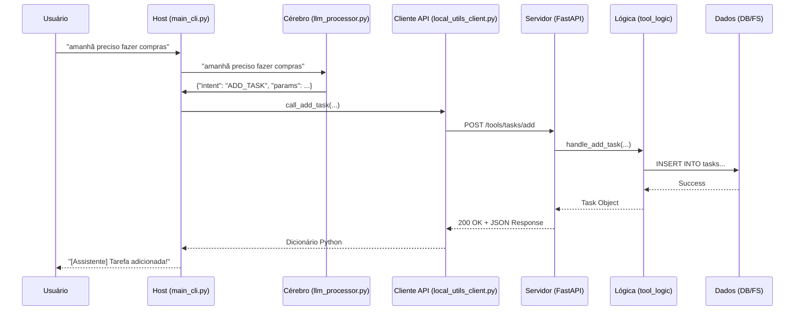

# Assistente Local de Organização e Utilitários via MCP

  

Um assistente de linha de comando (CLI) inteligente que utiliza um Modelo de Linguagem Grande (LLM) para interpretar comandos do usuário em linguagem natural e controlar ferramentas locais através de uma arquitetura baseada em Micro-serviços/API.

Este projeto foi desenvolvido para demonstrar a separação de responsabilidades em um sistema, onde um "Host" inteligente orquestra as ações de um "Servidor" de ferramentas, comunicando-se exclusivamente através de uma API RESTful.

## 🏛️ Arquitetura e Conceitos Fundamentais

O projeto é dividido em dois componentes principais que rodam de forma independente: o **Host** e o **Servidor**.

### 1\. Servidor de Ferramentas (`server_mcp_tools`)

  - **O "Corpo" do Sistema**: É uma aplicação **FastAPI** que atua como o motor de ferramentas. Ele não sabe nada sobre o usuário ou sobre IA. Sua única responsabilidade é expor um conjunto de "habilidades" através de uma API RESTful bem definida.
  - **Responsabilidades**:
      - Gerenciar o banco de dados de tarefas (via SQLite).
      - Realizar operações no sistema de arquivos de forma segura, dentro de um workspace pré-definido.
      - Fornecer informações do sistema (como data e hora).
      - Validar todos os dados de entrada usando **Pydantic**.

### 2\. Host Inteligente (`host_mcp`)

  - **O "Cérebro" do Sistema**: É a aplicação de linha de comando com a qual o usuário interage. É ele quem contém a "inteligência" do assistente.
  - **Responsabilidades**:
      - Receber comandos do usuário em linguagem natural.
      - Utilizar a API do **Google Gemini** para traduzir o comando em uma "intenção" e "parâmetros" estruturados (em formato JSON).
      - Com base na intenção, chamar o endpoint apropriado no Servidor de Ferramentas usando um cliente HTTP (`requests`).
      - Formatar e apresentar a resposta do servidor para o usuário.

### Fluxo de Execução

O fluxo de um comando demonstra perfeitamente a arquitetura:



## ✨ Funcionalidades

### Gerenciamento de Tarefas

  - **Adicionar Tarefas**: Adiciona novas tarefas à lista.
  - **Inteligência de Datas**: Compreende datas relativas como "hoje" e "amanhã".
  - **Listar Tarefas**: Lista todas as tarefas, com opção de filtrar por status (`pendente`, `concluída`).
  - **Concluir Tarefas por ID**: Marca uma tarefa como concluída usando seu ID numérico.
  - **Conclusão por Contexto**: Marca uma tarefa como concluída com base na descrição (ex: "já comprei o pão").

### Utilitários de Arquivos e Sistema

  - **Listar Arquivos**: Lista arquivos dentro de um workspace seguro.
  - **Filtrar Arquivos**: Permite filtrar a listagem por extensão (ex: `.pdf`, `.txt`).
  - **Informações do Sistema**: Obtém a data e hora atuais do servidor.

## 🛠️ Tecnologias Utilizadas

  - **Linguagem**: Python 3.10+
  - **Servidor**:
      - **FastAPI**: Para a construção da API RESTful de alta performance.
      - **Uvicorn**: Como servidor ASGI para rodar a aplicação FastAPI.
      - **Pydantic**: Para validação e modelagem de dados robusta.
      - **SQLite**: Como banco de dados relacional em arquivo, gerenciado pelo módulo padrão `sqlite3`.
  - **Host**:
      - **Google Generative AI**: Para acesso à API do LLM Gemini.
      - **Requests**: Para realizar as chamadas HTTP ao servidor.
      - **python-dotenv**: Para gerenciar as chaves de API de forma segura.

## 📂 Estrutura do Projeto

```
assistente_local_mcp/
├── host_mcp/                   # Componente Host: interage com o usuário e orquestra
│   ├── .env                    # Arquivo para armazenar a chave da API (NÃO versionar!)
│   ├── main_cli.py             # Ponto de entrada da aplicação CLI, loop principal
│   ├── llm_processor.py        # Lógica para interagir com o LLM
│   └── mcp_clients/            # Módulo contendo os clientes para os servidores
│       └── local_utils_client.py
├── server_mcp_tools/           # Componente Servidor: expõe as ferramentas locais
│   ├── main_server.py          # Aplicação FastAPI: define endpoints
│   ├── models_pydantic.py      # Modelos Pydantic para validação
│   ├── tool_logic/             # Módulos com a lógica de cada ferramenta
│   └── data_storage/           # Armazenamento de dados (DB e workspace)
├── .gitignore                  # Arquivos e pastas a serem ignorados pelo Git
└── requirements.txt            # Lista de dependências Python
```

## 🚀 Instalação e Execução

Siga os passos abaixo para configurar e rodar o projeto.

### Pré-requisitos

  - Python 3.10 ou superior
  - Git

### 1\. Clonar o Repositório

```bash
git clone <url-do-seu-repositorio>
cd assistente_local_mcp
```

### 2\. Configurar o Ambiente Virtual

É altamente recomendado usar um ambiente virtual para isolar as dependências do projeto.

```bash
# Criar o ambiente virtual
python -m venv venv

# Ativar o ambiente
# No Windows:
venv\Scripts\activate
# No macOS/Linux:
source venv/bin/activate
```

### 3\. Instalar as Dependências

Com o ambiente virtual ativo, instale todas as bibliotecas necessárias.

```bash
pip install -r requirements.txt
```

### 4\. Configurar a Chave de API

Você precisará de uma chave de API do Google para usar o modelo Gemini.

1.  Obtenha sua chave no [Google AI Studio](https://aistudio.google.com/app/apikey).
2.  Na pasta `host_mcp/`, crie um arquivo chamado `.env`.
3.  Adicione o seguinte conteúdo ao arquivo `.env`, substituindo `sua_chave_aqui` pela sua chave real:
    ```
    GEMINI_API_KEY="sua_chave_aqui"
    ```

### 5\. Rodando o Sistema

O sistema precisa que os dois componentes (Servidor e Host) rodem simultaneamente em dois terminais diferentes.

**No Terminal 1 - Inicie o Servidor:**
(Certifique-se de que o ambiente virtual está ativo)

```bash
uvicorn server_mcp_tools.main_server:app --reload
```

Deixe este terminal aberto. Você verá os logs do servidor nele.

**No Terminal 2 - Inicie o Host (Assistente):**
(Abra um novo terminal e ative o mesmo ambiente virtual)

```bash
python host_mcp/main_cli.py
```

Agora você pode começar a interagir com o assistente\!

## 💬 Exemplo de Uso

```
--- Assistente Local de Organização e Utilitários ---
Digite seu comando ou 'sair' para terminar.

[Você] > amanhã tenho a defesa da monografia
🧠 (Debug: Intenção='ADD_TASK', Parâmetros={'description': 'defesa da monografia', 'due_date': '2025-06-09'})

[Assistente] ✅ Tarefa 'defesa da monografia' adicionada com sucesso!

[Você] > quais são minhas tarefas pendentes?
🧠 (Debug: Intenção='LIST_TASKS', Parâmetros={'status': 'pendente'})

--- Suas Tarefas ---
⏳ ID 1: defesa da monografia (Vencimento: 2025-06-09)
--------------------

[Você] > já defendi a monografia
🧠 (Debug: Intenção='COMPLETE_TASK_BY_DESCRIPTION', Parâmetros={'description_hint': 'defendi a monografia'})

[Assistente] ✅ Tarefa 'defesa da monografia' marcada como concluída!

[Você] > sair
[Assistente] Até logo!
```

## 🗺️ Possíveis Melhorias Futuras

  - **Novas Ferramentas**: Adicionar novas habilidades ao servidor, como integração com Google Agenda, envio de emails ou conversão de arquivos.
  - **Interface Gráfica (GUI)**: Criar uma interface gráfica usando uma biblioteca como PyQt, Tkinter ou uma interface web com o próprio FastAPI.
  - **Containerização**: Empacotar o servidor em um container Docker para facilitar o deploy.
  - **Segurança**: Adicionar autenticação à API do servidor para que apenas hosts autorizados possam usá-la.

## 👨‍💻 Autor

**Jonatas Mota** - *Desenvolvedor do Projeto*